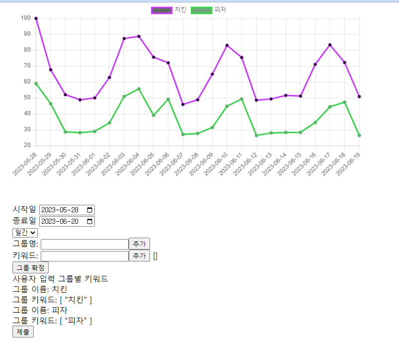

# [project4] Data Visualization (Vue3)

# 4주차 프로젝트 : Web PJT 데이터 시각화

임베디드 뿐만 아니라 수 많은 분야에서 data들은 존재하기 마련이다. 이에 따라 data를 요구사항에 맞게 시각화(visualization) 하는 연습이 필요하다. 따라서 해당 프로젝트를 통해 네이버 datalab API를 사용해 키워드 검색어 추이를 가져와 차트로 나타내는 Data Visualizing을 진행한다.



## 1. 요구사항 정리

naver datalab api 를 활용해서 data 를 시각화한다.

A. API 서버 구축하기

1. express 서버에서 naver datalab api 를 가져온다.
2. api 를 axios 로 가져와서 리턴해주는 프로젝트를 생성한다.

B.  Vue.js 로 visualizing

1. axios 로 express 단에 요청을 보낸다.
2. 응답 값을 chart 화 시킨다.

## 2. 기술 Stack

      A. express(Node.js)

      B. Vue3

## 3. 개발 환경 구축

웹 개발 에디터인 Visual Studio Code 를 사용한다.

## 4. 기본 세팅하기

### A. 백엔드 구축

`server/` 디렉터리에서 `$ npm init`  한 후, package.json 을 생성했다.

```bash
$ npm i express morgan cors axios dotenv
```

| Package 이름 | 내용 |
| --- | --- |
| express | Node.js 서버 프레임워크 |
| morgan | 클라이언트 http 요청이 들어올 때 로그를 상세히 출력 |
| cors | CORS 정책 허용 |
| axios | 서버 코드에서 네이버 API 에 접근해 ajax 비동기통신을 하기 위해 설치 |
| dotenv | 환경변수 분리를 위한 라이브러리 |


`index.js` 파일을 생성 후, 다음 코드를 기입한다.

```jsx
const express = require("express");

const app = express();
const PORT = 8080;

const cors = require("cors");
app.use(cors());

const morgan = require("morgan");
app.use(morgan("dev"));

app.use(express.json());

app.get("/", async (req, res) => {
	try {
		return res.json({
      test: true,
    });
	} catch (error) {
		return res.json({
			test: false,
		});
	}
});

app.listen(PORT, () => console.log(`this server listening on ${PORT}`));
```

서버가 잘 동작하는지 테스트해보자.

```bash
$ nodemon index
```


POSTMAN 으로 테스트 시, 이상 없이 잘 작동된다.

### B. 프론트엔드 구축

먼저, 원하는 디렉터리에 cmd 경로 잡고, 다음과 같이 입력해 프로젝트를 생성한다.

```bash
$ npm init vue@3
```

```bash
Vue.js - The Progressive JavaScript Framework

// 프로젝트 이름
√ Project name: ... vue-project

// 타입스크립트 사용. No 선택
√ Add TypeScript? ... No / Yes

// JSX 사용. No 선택
√ Add JSX Support? ... No / Yes

// 라우터 사용. Yes 선택
√ Add Vue Router for Single Page Application development? ... No / Yes

// Pinia 사용. Yes 선택
√ Add Pinia for state management? ... No / Yes

// 유닛테스팅. No 선택
√ Add Vitest for Unit Testing? ... No / Yes

// 테스팅 솔루션. No 선택
√ Add an End-to-End Testing Solution? » No

// ESLint. No 선택
√ Add ESLint for code quality? ... No / Yes

Scaffolding project in C:\Users\SSAFY\Desktop\vue-project...
```

```bash
Done. Now run:

  cd vue-project
  npm install
  npm run dev
```

`cd vue-project` : 현재 위치에 존재하는 `vue-project/` 디렉터리로 이동하라

`npm install` : `vue-project/package.json` 의 `dependencies` , `devDependencies` 에 기록된 패키지를 설치하라 (추후 상세히 설명)

`npm run dev` : 프론트엔드 서버를 구동하라.

세 가지 명령어를 그대로 따라치면, 다음과 같은 화면이 나온다.

```bash
VITE v4.3.8  ready in 680 ms

  ➜  Local:   http://localhost:5173/
  ➜  Network: use --host to expose
  ➜  press h to show help
```

브라우저를 켜고 `http://localhost:5173` 으로 접속하면 다음과 같다.


다음과 같은 Vue.js 웰컴 페이지가 나왔다. 

우리가 당장 쓸 수 있도록 프로젝트 구조를 바꿔보자.


`src/assets/` 디렉터리부터 정리하겠다.

우선 `base.css` 와 `logo.svg` 를 삭제하고, `main.css` 의 모든 내용을 지운 후, 다음과 같이 입력한다.

```bash
* {
  box-sizing: border-box;
  margin: 0;
}
```

- `main.css` 는 전역 스타일링 파일이다.
- `box-sizing` 은 박스의 크기를 화면에 표시하는 방식을 변경하는 프로퍼티다. 테두리가 있는 경우에는 테두리의 두께로 인해서 원하는 크기를 찾기가 어려운데, `box-sizing` 프로퍼티를 `border-box`로 지정하면 테두리를 포함한 크기를 지정할 수 있기 때문에 크기를 예측하기가 더 쉽다. 기본적으로 프로젝트를 하나 만들면, 모든 엘리먼트에 이 값을 지정하고 시작한다.
- `margin: 0` 은 각 태그에 기본적으로 잡혀있는 공백을 제거해준다.

다음, `src/components/` 하위 모든 파일, 디렉터리를 삭제한다.


다음, `src/views/` 아래의 `HomeView.vue` 를 다음과 같이 변경한다.


```html
<template>
  <h1>Home</h1>
</template>
```

마지막으로, `src/App.vue` 를 다음과 같이 변경한다.


```html
<script setup>
import { RouterLink, RouterView } from 'vue-router'
</script>

<template>   
  <RouterView />
</template>
```

여기까지 완료한 후, 서버를 동작시킨다.

```bash
$ npm run dev

VITE v4.3.8  ready in 364 ms`

  ➜  Local:   http://localhost:5173/
  ➜  Network: use --host to expose
  ➜  press h to show help
```

`localhost:5173` 로 접속해보자.


다음과 같이 구성한 후, 프로젝트를 위해 필요한 패키지를 생성하자.

```bash
$ npm i axios vue-chartjs chart.js
```

| Package 이름 | 내용 |
| --- | --- |
| axios | 비동기 요청 라이브러리 |
| chart.js | JavaScript Chart 라이브러리 |
| vue-chartjs | chart.js 를 Vue.js 에서 사용하기 위한 라이브러리 |

여기까지 진행하면 `server/` 와 `client/` 의 기초 세팅은 마무리된다.

### C. API 사용하기

네이버의 datalab API 를 활용한다.

`[https://developers.naver.com/main/](https://developers.naver.com/main/)`

접속해서 로그인 후, 


애플리케이션 등록을 진행해준다.


사용 API - 데이터랩 (검색어트렌드), 데이터랩 (쇼핑인사이트)

환경 - WEB

URL - `http://127.0.0.1`

 

## 5. Backend 구축하기

`server/index.js` 에 다음을 추가한다.

```jsx
const axios = require("axios");
const dotenv = require("dotenv");
const fs = require("fs");
dotenv.config();
```

`fs` 를 사용했다. 즉, 파일을 작성할 계획이다.

`dotenv.config()` 는 `.env` 파일에 접근하기 위한 세팅이다. 아이디, 비밀번호, API 키 등 중요 정보를 `index.js` 파일이 아니라, `.env` 파일에서 따로 관리한다.

`.env` 파일을 생성해서 발급된 API ID와 비밀번호를 기입한다.


추가로, api 요청 시 에러를 방지하기위해 `server/` 에 `uploads/` 라는 디렉터리를 미리 만들어두자.

작성할 REST API 는 다음과 같다.

| POST /data | 네이버 검색 API 에, 시작일과 종료일, 검색어 등을 포함한 JSON 을 비동기통신으로 보낸 후, 네이버에서 보낸 요청에 대한 결과를 uploads/chart.js 파일로 저장 |
| --- | --- |
| GET /data | uploads/chart.json 에 저장된 데이터를 JSON 포맷으로 출력 |
| DELETE /data | uploads/chart.js 파일 삭제 |

이제 data 를 받아오는 `app.post` 를 작성해본다.

```jsx
app.post("/data", async (req, res) => {
	try {
		const request_body = {
			startDate: "2023-12-01",
			endDate: "2024-03-01",
			// date, week, month 세 가지 제공
			timeUnit: "month",
			keywordGroups: [
				{
					groupName: "코로나",
					keywords: ["코로나", "covid", "백신", "거리두기"],
				},
				{ 
					groupName: "금리", 
					keywords: ["금리", "파월"],
				},
				{
					groupName: "파묘",
					keywords: ["파묘"],
				},
			],
		};
		const url = "https://openapi.naver.com/v1/datalab/search";
		const headers = {
			"Content-Type": "application/json",
			"X-Naver-Client-Id": process.env.CLIENT_ID,
			"X-Naver-Client-Secret": process.env.CLIENT_SECRET,
		};
		const response = await axios.post(url, request_body, {
			headers: headers,
		});

		fs.writeFile(
			`./uploads/chart.json`,
			JSON.stringify(response.data.results),
			(error) => {
				if (error) {
					throw error;
				}
			}
		);
		return res.json(response.data.results);
	} catch (error) {
		return res.json(error);
	}
});
```

우선, Postman 으로 테스트해보면,


다음과 같은 결과가 잘 찍히고, 이 결과는


`uploads/chart.json` 에 파일로 잘 저장된것을 확인할 수 있다.

이제 각 코드가 무엇을 의미하는지 분석해보자.

```jsx
app.post("/data", async (req, res) => {
	try {
		const request_body = {
			startDate: "2023-12-01",
			endDate: "2024-03-01",
			// date, week, month 세 가지 제공
			timeUnit: "month",
			keywordGroups: [
				{
					groupName: "코로나",
					keywords: ["코로나", "covid", "백신", "거리두기"],
				},
				{ 
					groupName: "금리", 
					keywords: ["금리", "파월"],
        },
				{
					groupName: "파묘",
					keywords: ["파묘"],
				},
			],
		};
```

서버로 딸려보낼 `JSON` 을 `request_body` 라고 이름지었다.
우리가 원하는 건, 검색결과이다. 2023년 12월 1일부터, 2024년 3월 1일 세 달간,
`keywordGroups` 에 해당하는 검색어로 검색한 결과를 보고자 한다.
`groupName` 은 총 3개로서, 각각 검색 키워드들의 결과를 묶을 것이다.
즉, 3개월간 각 이슈들의 흐름을 분석하고자 한다.

```jsx
		const url = "https://openapi.naver.com/v1/datalab/search";
		const headers = {
			"Content-Type": "application/json",
			"X-Naver-Client-Id": process.env.CLIENT_ID,
			"X-Naver-Client-Secret": process.env.CLIENT_SECRET,
		};
		const response = await axios.post(url, request_body, {
			headers: headers,
		});
```

보낼 `url` 과, `header` 라는 걸 같이 딸려보낼 것인데,
`header` 는 서버 코드에 들어갈 설정이라고 보면 된다.
api 사용할 때 어떤 식으로 적으라고 써있기 때문에 그것을 기반으로 적은 것이지만,
우리는 `JSON` 타입으로 받길 원하기 때문에 `Content-Type` 이 `JSON` 이고,
아이디와 비밀번호를 직접 입력하지 않고 `.env` 파일에서 가져와 쓴다.

`.env` 파일의 존재이유는, 코드에 중요 정보를 나타내지 않음으로서 해커가 공격할 수 있는 빌미를 사전 차단하기 위함이다.

그리고 `axios.post` 통신을 진행하는데, `url`, `request_body`, `header` 를 모두 딸려보낸다.

```jsx
		fs.writeFile(
			`./uploads/chart.json`,
			JSON.stringify(response.data.results),
			(error) => {
				if (error) {
					throw error;
				}
			}
		);
		return res.json(response.data.results);
```

그리고, 요청이 성공했을 때 차트를 그리기위한 배열이 주어질 것이다.
따라서, 우리는 서버에서 받아온 데이터로 `chart.json` 이라는 파일을 생성할 것인데,
`JSON.stringify` 는 받아온 데이터를 `JSON` 양식으로 바꿀 때 쓴다.

여기서 주의 할 점은 `chart.json` 파일은 단순 데이터를 저장하고 보여주는 서버에 대한 부하를 덜어주기위한 캐싱의 목적으로만 사용하고 있다. 가져온 데이터의 내용을 변경하거나 추가하면 안되는 것에 유의한다.

지금까지 작성한 `HTTP` 요청은 `POST` 이다. 목적은 무엇인가? 

`POST /data`

네이버 검색 API 에, 시작일과 종료일, 검색어 등을 포함한 `JSON` 을 비동기통신으로 보낸 후, 네이버에서 보낸 요청에 대한 결과를 `uploads/chart.js` 파일로 저장

즉, 내 백엔드 서버에 데이터 기록이다. 그래서 `POST` 인 것이다. 이제, `GET` 을 통해 파일을 읽어오는 로직을 작성해보자.

```jsx
app.get("/data", async (req, res) => {
	try {
		res.set("Content-Type", "application/json; charset=utf-8");
		const tempFile = fs.createReadStream("uploads/chart.json");
		return tempFile.pipe(res);
	} catch (error) {
		return res.json(error);
	}
}); 
```

결론적으로`POST` 요청시에 만들어진 `chart.json`을 단순 리턴해주는 로직이다.

`res.set` 은 `res` 객체 설정인데, `JSON` 타입이고, 한글을 위해 `utf-8` 로 설정했다.
파일을 해당 경로에서 읽어오고, 담은 다음, `pipe()` 를 써주었다.
`pipe()` 행에 대해 좀 더 설명을 덧붙이자면, `tempFile` 은 readable stream 이며,
`res` 는 목적지이다. 즉, 응답, `res` 객체이다
`pipe` 는 둘을 연결할 때 쓴다.
그 실행결과를 리턴하게 되고, `chart.json` 이 `JSON` 포맷으로 보여지게 된다.

```json
[
    {
        "title": "코로나",
        "keywords": [
            "코로나",
            "covid",
            "백신",
            "거리두기"
        ],
        "data": [
            {
                "period": "2023-12-01",
                "ratio": 2.86058
            },
            {
                "period": "2024-01-01",
                "ratio": 2.92578
            },
            {
                "period": "2024-02-01",
                "ratio": 2.50966
            },
            {
                "period": "2024-03-01",
                "ratio": 0.9221
            }
        ]
    },
    {
        "title": "금리",
        "keywords": [
            "금리",
            "파월"
        ],
        "data": [
            {
                "period": "2023-12-01",
                "ratio": 2.27234
            },
            {
                "period": "2024-01-01",
                "ratio": 1.8494
            },
            {
                "period": "2024-02-01",
                "ratio": 1.70964
            },
            {
                "period": "2024-03-01",
                "ratio": 1.04201
            }
        ]
    },
    {
        "title": "파묘",
        "keywords": [
            "파묘"
        ],
        "data": [
            {
                "period": "2023-12-01",
                "ratio": 0.80285
            },
            {
                "period": "2024-01-01",
                "ratio": 10.95334
            },
            {
                "period": "2024-02-01",
                "ratio": 100
            },
            {
                "period": "2024-03-01",
                "ratio": 61.17571
            }
        ]
    }
]
```

단순히 `string` 일 경우, 컬러 하이라이팅이나 인덴팅이 적용되지 않아 가져오기 실패한 경우라고 보면 된다. 지금의 경우, `JSON` 포맷에 알맞게 잘 가져왔기 때문에 결과도 잘 나왔다.

이제 `DELETE` 요청 또한 만들어준다.

```jsx
app.delete("/data", (req, res) => {
	try {
		fs.unlink("uploads/chart.json", (error) => {
			if (error) {
				return res.json(error);
			}
		});
		return res.json({
			delete: true,
		});
	} catch (error) {
		return res.json(error);
	}
});
```

`fs.unlink()` 는 해당 파일 삭제를 뜻한다. 삭제 성공시 확인 가능한 간단한 `JSON` 리턴한다.


파일이 사라진 것을 확인할 수 있다.

이제 요청에 따라 데이터를 맞게 요청 할 수 있게 `app.post('/data')`를 수정해준다.
이미 `app.post('data')` 가 만들어져 있지만, 클라이언트가 어떤 데이터를 입력한 게 아니라 단순히 하드코딩한 데이터로 네이버 API 를 사용했을 뿐이다.
지금부턴, 테스트를 위한 하드코딩 부분을 빼버리고, 클라이언트에서 입력을 받아 결과를 확인해보도록 한다.


이것은 우리가 사용할 API 공식문서의 일부분이다. 전체 공식문서는 `https://[developers.naver.com/docs/serviceapi/datalab/search/search.md](http://developers.naver.com/docs/serviceapi/datalab/search/search.md)` 에서 확인 가능하다.

이를 기반으로 `POST /data` 를 수정해보면 다음과 같다.

```jsx
app.post("/data", async (req, res) => {
	const { startDate, endDate, timeUnit, device, gender, keywordGroups } =
		req.body;
	try {
		const request_body = {
			startDate: startDate,
			endDate: endDate,
			timeUnit: timeUnit,
			device: device === "all" ? "" : device,
			gender: gender === "all" ? "" : gender,
			keywordGroups: keywordGroups,
		};
```

이젠 하드코딩이 아니라, 클라이언트에서 준 데이터를 기반으로 통신할 것이므로 `req.body` 에서 딸려온 것들을 변수로 받아서, `request_body` 를 재작성한다.
삼항연산자가 나오긴 했는데, 만약 `device` 가 `all` 이면 `device` 는 빈 `string`이고,  특정 값이 있으면 해당 값을 딸려보낸다. `gender` 도 마찬가지다.

```json
{
    "startDate": "2023-12-01",
    "endDate": "2024-03-01",
    "timeUnit": "month",
    "keywordGroups": [
        {
            "groupName": "코로나",
            "keywords": ["코로나", "covid", "백신", "거리두기"]
        },
        {
            "groupName": "금리",
            "keywords": ["금리", "파월"]
        },
        {
            "groupName": "파묘",
            "keywords": ["파묘"]
        }
    ]
}
```

2023년 12월 1일부터 3월 1일까지 주요 이슈 세 가지는 코로나, 금리, 파묘였다.

다음과 같은 `JSON` 데이터를 POSTMAN 으로, `POST /data` 로 보냈을 때,


통신 성공 후 API 결과값이 리턴되었고,


`chart.json` 에서 차트 데이터도 잘 받아왔다.

백엔드 구축은 이로서 마무리된다.

## 6. Frontend 구축하기

`src/components/LineChart.vue` 를 생성하고, 다음과 같이 기입한다. 아래 코드는 `vue-chartjs` 패키지를 Line Chart 의 샘플코드를, 우리가 쓸 목적에 맞게 코딩한 코드다.

우리는 해당 코드를 

1. ref를 활용해서 차트 데이터 삽입
2. 해당 데이터를 pinia로 분리
3. 백엔드 데이터 연동 과정을 거쳐 변경할 예정이다.

```html
<script setup>
import { Line } from "vue-chartjs";
import { ref } from "vue";

import {
  Chart as ChartJS,
  CategoryScale,
  LinearScale,
  PointElement,
  LineElement,
  Title,
  Tooltip,
  Legend,
} from "chart.js";

ChartJS.register(
  CategoryScale,
  LinearScale,
  PointElement,
  LineElement,
  Title,
  Tooltip,
  Legend
);

const chartData = ref({
  labels: ["January", "February", "March"],
  datasets: [
    {
      label: "A",
      backgroundColor: "blue",
      borderColor: "blue",
      data: [7.17983, 8.21018, 15.56848],
    },
    {
      label: "B",
      backgroundColor: "red",
      borderColor: "orange",
      data: [33.32972, 50, 10.34851],
    },
    {
      label: "C",
      backgroundColor: "green",
      borderColor: "green",
      data: [40.73772, 1.89189, 0.13467],
    },
  ],
});

const chartOptions = ref({
  responsive: true,
});
</script>

<template>
  <Line id="my-chart-id" :options="chartOptions" :data="chartData" />
</template>

```

그리고, `HomeView.vue` 에서 `LineChart.vue` 를 자식 컴포넌트로 사용한다.

```html
<script setup>
import LineChart from "./components/LineChart.vue";
</script>

<template>
  <LineChart />
</template>
```

다음과 같은 화면을 볼 수 있다.


이 결과를 기반으로, `LineChart.vue` 에서 필요한 부분만 분석해보자.

```html
<template>
  <Line id="my-chart-id" :options="chartOptions" :data="chartData" />
</template>
```

`Line` 컴포넌트는 `vue-chartjs` 에서 Line Chart, 즉 꺾은선그래프를 사용하기 위한 컴포넌트다. 여기에 각종 `props` 를 내려보내 데이터를 등록하는것을 알 수 있다.

`<script>` 의 내용을 살펴보자.

```html
<script setup>
import { Line } from "vue-chartjs";
import { ref } from "vue";

import {
  Chart as ChartJS,
  CategoryScale,
  LinearScale,
  PointElement,
  LineElement,
  Title,
  Tooltip,
  Legend,
} from "chart.js";

ChartJS.register(
  CategoryScale,
  LinearScale,
  PointElement,
  LineElement,
  Title,
  Tooltip,
  Legend
);

const chartData = ref({
  labels: ["January", "February", "March"],
  datasets: [
    {
      label: "A",
      backgroundColor: "blue",
      borderColor: "blue",
      data: [7.17983, 8.21018, 15.56848],
    },
    {
      label: "B",
      backgroundColor: "red",
      borderColor: "orange",
      data: [33.32972, 50, 10.34851],
    },
    {
      label: "C",
      backgroundColor: "green",
      borderColor: "green",
      data: [40.73772, 1.89189, 0.13467],
    },
  ],
});

const chartOptions = ref({
  responsive: true,
});
</script>
```

vue chart.js는 차트를 사용하기 위해 각 차트별 기본으로 필요한 요소 들을 등록해줘야 하는 방식인데

[https://vue-chartjs.org/examples/](https://vue-chartjs.org/examples/)

해당 링크에  기본으로 어떤 요소가 필요한지 정의되어있다.

```jsx
const chartData = ref({
  labels: ["January", "February", "March"],
  datasets: [
    {
      label: "A",
      backgroundColor: "blue",
      borderColor: "blue",
      data: [7.17983, 8.21018, 15.56848],
    },
    {
      label: "B",
      backgroundColor: "red",
      borderColor: "orange",
      data: [33.32972, 50, 10.34851],
    },
    {
      label: "C",
      backgroundColor: "green",
      borderColor: "green",
      data: [40.73772, 1.89189, 0.13467],
    },
  ],
});

const chartOptions = ref({
  responsive: true,
});
</script>

<template>
  <Line id="my-chart-id" :options="chartOptions" :data="chartData" />
</template>

```

차트는 기본적으로 data 부분과 options 파트로 나뉘어져 있다. 

`props` 로 내려보낼 데이터들이다. 그리고 `options` 와 `data` 를 내려보내는데, `chartData` 내부엔 `labels` 는 배열이다. 표의 x축의 기준이 될 것이다.

`dataSets` 안에는 크기가 3인 배열이 들어갔는데, 각각의 라벨, 구분할 색깔, 들어갈 데이터가 있고, 제일 중요한 `data` 는 배열로 이루어져 있다.

`chartOptions` 는 현재 차트의 옵션값 지정이다.

`chart.js` 공식문서를 참고해, 여러가지 설정을 바꿀 수 있다. 곡선을 부드럽게하려면 `datasets` 배열의 각각의 객체에 `tension` 을 추가할 수 있다.

```jsx
datasets: [
  {
    label: "A",
    backgroundColor: "blue",
    borderColor: "blue",
    data: [7.17983, 8.21018, 15.56848],
    tension: 0.3,
  },
  {
    label: "B",
    backgroundColor: "red",
    borderColor: "orange",
    data: [33.32972, 50, 10.34851],
    tension: 0.3,
  },
  {
    label: "C",
    backgroundColor: "green",
    borderColor: "green",
    data: [40.73772, 1.89189, 0.13467],
    tension: 0.3,
  },
],
```

다음과 같이, 각각 `tension: 0.3` 으로 지정했을 때, 그래프는 다음과 같이 좀 더 부드럽게 바뀐다.


이제 해당 chart의 data와 옵션을 전역 상태관리로 분리할 예정이다.


우리는 위 처럼 사용자 Form 을 작성 하면 차트가 갱신되는 형태를 만들것이기 때문에 차트의 데이터를 전역으로 관리할 필요가 생겼다.

그래서 pinia를 활용해서 변경할예정이다.

stores/chart.js 를 생성한다. 

```jsx
import { ref } from "vue";
import { defineStore } from "pinia";

export const useChartStore = defineStore("chart", () => {
  const chartData = ref({
    labels: ["2023-04-01", "2023-05-01", "2023-06-01"],
    datasets: [
      {
        label: "A",
        backgroundColor: "blue",
        borderColor: "blue",
        data: [7.17983, 8.21018, 15.56848],
        tension: 0.3,
      },
      {
        label: "B",
        backgroundColor: "red",
        borderColor: "orange",
        data: [33.32972, 50, 10.34851],
        tension: 0.3,
      },
      {
        label: "C",
        backgroundColor: "green",
        borderColor: "green",
        data: [40.73772, 1.89189, 0.13467],
        tension: 0.3,
      },
    ],
  });

  function setChartData(data) {
    chartData.value = data;
  }

  return { chartData, setChartData };
});

```

기존에 chartData를 pinia를 활용해 store로 분리하였다.

이제 해당 chartData를 LineChart에 적용하면 된다.

```html
<script setup>
import { Line } from "vue-chartjs";
import { ref } from "vue";
import { useChartStore } from "@/stores/chart.js";
const chartStore = useChartStore();

import {
  Chart as ChartJS,
  CategoryScale,
  LinearScale,
  PointElement,
  LineElement,
  Title,
  Tooltip,
  Legend,
} from "chart.js";

ChartJS.register(
  CategoryScale,
  LinearScale,
  PointElement,
  LineElement,
  Title,
  Tooltip,
  Legend
);

const chartOptions = ref({
  responsive: true,
});
</script>

<template>
  <Line id="my-chart-id" :options="chartOptions" :data="chartStore.chartData" />
</template>

```

기존에 chartData 대신 useChartStore를 활용해서 pinia로부터 chartData를 가져와서 대입한다.


차트가 그대로 잘 적용된것을 확인할수 있다. 

이제 무엇을 하면 되는가? 하드코딩으로 다음과 같은 그래프를 구현할 수 있다는 뜻은, 프론트엔드에서 백엔드에 적절한 요청을 보냈을 때, 그래프의 데이터를 적절히 갱신하여 원하는 그래프로 바꿀 수 있음을 뜻한다.

이에, 다음의 작업을 필요로 한다.

1. 프론트엔드 `axios` API
2. 입력 창
3. 적절한 데이터 파싱

우선, `axios` API 제작을 위해 `utils/` 디렉터리를 만들고, `api.js` 파일을 생성해 다음 코드를 기입한다.

utils/api.js

```jsx
import axios from "axios";

const api = axios.create({
  baseURL: "http://localhost:8080",
});

const dataLab = {
  get: () => {
    return api.get("/data");
  },
  post: (data) => {
    return api.post("/data", data);
  },
  delete: () => {
    return api.delete("/data");
  },
};

export default dataLab;
```

이제 해당 api를 호출해서 데이터가 잘 나오는지 확인하자.

`HomeView.vue`

```html
<script setup>
import LineChart from "@/components/LineChart.vue";
import dataLap from "@/utils/api";

async function getData() {
  try {
    const response = await dataLap.get();
    console.log(response.data);
  } catch (error) {
    console.error(error);
  }
}

getData();
</script>

<template>
  <LineChart />
</template>
```


데이터가 정상적으로 출력이되는것을 확인했다.

여기서, `ratio` 는 상대적인 기준이다. 각각의 데이터들을 비교해 해당 날짜의 검색어 빈도를 나타낸다. 반드시, 전체 데이터 중 기준이 되는 `ratio` 100 과 0은 존재한다.

이제 해당 데이터를 pinia에서 호출해서 데이터 처리할수 있도록 진행해보자. 

  `stores/chart.js`  파일을 다음과 같이 수정한다.

```jsx
import { ref } from "vue";
import { defineStore } from "pinia";
import dataLap from "@/utils/api";

export const useChartStore = defineStore("chart", () => {
  const chartData = ref({
    labels: ["2023-04-01", "2023-05-01", "2023-06-01"],
    datasets: [
      {
        label: "A",
        backgroundColor: "blue",
        borderColor: "blue",
        data: [7.17983, 8.21018, 15.56848],
        tension: 0.3,
      },
      {},
    ],
  });

  function setChartData(data) {
    chartData.value = data;
  }

  function makeColor() {
    return "#" + Math.round(Math.random() * 0xffffff).toString(16);
  }

  async function makeChart() {
    try {
      const response = await dataLap.get();

      const chartData = {
        labels: response.data[0].data.map((li) => li.period),
        datasets: response.data.reduce((acc, cur) => {
          const label = cur.title;
          const data = cur.data.map((li) => li.ratio);
          acc.push({
            label: label,
            data: data,
            fill: false,
            backgroundColor: makeColor(),
            borderColor: makeColor(),
          });
          return acc;
        }, []),
      };

      setChartData(chartData);
    } catch (error) {
      console.log(error);
    }
  }

  return { chartData, setChartData, makeChart };
});

```

makeColor 함수는 단순랜덤 색상값을 만들기 위해 작성한 코드이다.

makeChart 함수를 통해 backend에 데이터를 요청 →  받아온 값을 가공해서 chart.js의 맞는 형식으로 바꿔준다. 

```json
labels:["2023-04-01","2023-05-01","2023-06-01"],
datasets: [
	{"label":"A", "backgroundColor":"blue", "borderColor":"blue", "data":[7.17983,8.21018,15.56848], "tension":0.3},
	{"label":"B", "backgroundColor":"red", "borderColor":"orange", "data":[33.32972,50,10.34851], "tension":0.3},
	{"label":"C", "backgroundColor":"green", "borderColor":"green", "data":[40.73772,1.89189,0.13467], "tension":0.3}
]
```

데이터들은 위처럼 가공된다. 

이제 chartStore에서 makeChart를 호출하면 

기존에 있던 chartStore의 chartData 값 → API로 호출해서 가공된 데이터값으로 갱신될 것이다. 

HomeView.vue

```html
<script setup>
import LineChart from "@/components/LineChart.vue";
import { useChartStore } from "@/stores/chart.js";

const chartStore = useChartStore();

chartStore.makeChart();
</script>

<template>
  <LineChart />
</template>

```

이제 성공적으로 차트를 불러오는데 성공했다. 


차트를 불러오는데 성공했으니 이제 사용자 입력을 위한 폼을 만들어줄 차례이다. 

사용자 입력을 위한 자식컴포넌트 하나 만들어 준다.


`UserForm.vue` 만들고,

```jsx
<script setup>
</script>

<template>
  <h1>Form</h1>
</template>
```

다음과 같이 기본 템플릿을 만들고,

`HomeView.vue` 에 import 하고, 등록하고, 붙인다.

```html
<script setup>
import LineChart from "@/components/LineChart.vue";
import UserForm from "@/components/UserForm.vue";
import { useChartStore } from "@/stores/chart.js";

const chartStore = useChartStore();

chartStore.makeChart();
</script>

<template>
  <LineChart />
  <UserForm />
</template>
```

여기서 할 일은, 다음과 같은 `JSON` 을 만드는 것이다.

```json
{
    "startDate": "2022-06-01",
    "endDate": "2023-06-01",
    "timeUnit": "month",
    "keywordGroups": [
        {
            "groupName": "치킨",
            "keywords": ["BBQ", "BHC", "교촌"]
        },
        {
            "groupName": "피자",
            "keywords": ["도미노", "피자헛", "피자알볼로"]
        },
     
}
```

그래서 우선 다음과 같은 화면을 만들 것이다.


제출 클릭시 아래와 같은 console이 나와야 한다. 


즉, 객체만 제대로 만들어 API 를 사용하기만 하면,

데이터를 받아와서 그래프를 바꿀 것이다.

`UserForm.vue` 의 `<template>`을 다음과 같이 작성한다.

```html
<template>
  <div>시작일 <input type="date" v-model="startDate" /></div>
  <div>종료일 <input type="date" v-model="endDate" /></div>
  <select v-model="timeUnit">
    <option value="date">일간</option>
    <option value="week">주간</option>
    <option value="month">월간</option>
  </select>
  <div>
    그룹명: <input type="text" v-model="userInputGroupName" />
    <button v-on:click="tempGroupAdd">추가</button>
    {{ tempGroupName }}
  </div>
  <div>
    키워드: <input type="text" v-model="userInputKeyword" />
    <button v-on:click="tempKeywordAdd">추가</button>
    {{ tempKeywords }}
  </div>
  <div>
    <button v-on:click="makeGroup">그룹 확정</button>
  </div>
  <p>사용자 입력 그룹별 키워드</p>
  <ul v-if="keywordGroups.length">
    <li v-for="(keywordGroup, index) in keywordGroups" v-bind:key="index">
      <p>그룹 이름: {{ keywordGroup.groupName }}</p>
      <p>그룹 키워드: {{ keywordGroup.keywords }}</p>
    </li>
  </ul>
  <input type="submit" v-on:click="sendResultToApi" />
</template>
```

Bootstrap 도 쓰지 않고, `<input>`, `<select>`, `<button>` 등 HTML 에서 기본 제공하는 태그들로 작성했다.
각각의 데이터를 `v-model` 로 연결해두고, `<button>`에 이벤트를 달아두었다.
화면에 붙일 것은 콧수염 `{{ }}`으로 작성했다.
`v-for` 도 사용했는데, 그룹이 여러 개일 수 있기 때문이다.
`v-if` 처리를 한 이유는, `keywordGroup` 이 아직 아무것도 없을 때는 보여주지 않기 위해서이고,
`v-for` 에서 `index` 를 키로 설정했다.
submit 을 클릭할 때, `sendResultToApi()` 메서드가 작동하도록 설정했는데, 이 버튼을 누르면 최종 데이터가 완성되고 서버로 전송된다.

`<script setup>`코드는 다음과 같다. 

```html
<script setup>
import { ref } from "vue";

const startDate = ref("");
const endDate = ref("");
const timeUnit = ref("month");
const keywordGroups = ref([]);
const userInputGroupName = ref("");
const userInputKeyword = ref("");
const tempGroupName = ref("");
const tempKeywords = ref([]);
const toApiData = ref({});

function tempGroupAdd() {
  tempGroupName.value = userInputGroupName.value;
}
function tempKeywordAdd() {
  tempKeywords.value.push(userInputKeyword.value);
  userInputKeyword.value = "";
}
function makeGroup() {
	console.log(tempGroupName)
  keywordGroups.value.push({
    groupName: tempGroupName.value,
    keywords: tempKeywords.value,
  });

  tempGroupName.value = "";
  tempKeywords.value = [];

  userInputGroupName.value = "";
}
function sendResultToApi() {
  toApiData.value = {
    startDate: startDate.value,
    endDate: endDate.value,
    timeUnit: timeUnit.value,
    keywordGroups: keywordGroups.value,
  };
  console.log(toApiData.value);
}
</script>
```

필요한 데이터를 기입하고, 이 데이터를 최종적으로 모아서 `sendResultToApi` 를 사용해 서버로 보낼 것이다.

작성한 메서드는 총 4개이다.

`tempGroupAdd()`

그룹명 옆에 추가 버튼을 누를 시에 작동된다. 사용자 입력 그룹 이름을 `tempGroupName` 에 임시로 보관한다.
`tempKeywordAdd()`

키워드 옆에 추가 버튼을 누를 시에 작동된다. 사용자 입력 키워드를 `tempKeywords` 배열에 `push()` 하고, 사용자 편의를 위해 입력창에서 키워드를 지워준다.

`makeGroup()`

그룹 확정 버튼을 누를 때 동작한다. `keywordGroups` 에 `push()` 하는데, `groupName`, `keywords` 객체 형태로 `push()` 하며, 추가 버튼 옆에 표시된 데이터들과 그룹명 입력창을 초기화한다.

`sendResultToApi()`

최종적으로 데이터 형태를 만들어 서버로 보낼 준비한다.
다음과 같은 형태로 만들어질 것이다.


제출 버튼 누를 시,


다음과 같이, 브라우저에 콘솔로 잘 찍힌다.

중요한것은, 콘솔에 찍힌 데이터가 우리가 원하는 형태로 준비되었는지이다. 즉, 이와 같이 콘솔에 찍힌 데이터는 다음 `JSON` 포맷과 일치해야한다.

```jsx
{
    "startDate": "2022-06-01",
    "endDate": "2023-06-01",
    "timeUnit": "month",
    "keywordGroups": [
        {
            "groupName": "치킨",
            "keywords": ["BBQ", "BHC", "교촌"]
        },
        {
            "groupName": "피자",
            "keywords": ["도미노", "피자헛", "피자알볼로"]
        },
     
}
```

이제 sendResultApi 호출 시 백엔드에 요청을 보내 차트를 갱신해주는 작업만 남았다. 

```html
<script setup>
import { ref } from "vue";

import dataLab from '@/utils/api';
import { useChartStore } from "@/stores/chart.js";
const chartStore = useChartStore();

const startDate = ref("");
const endDate = ref("");
const timeUnit = ref("month");
const keywordGroups = ref([]);
const userInputGroupName = ref("");
const userInputKeyword = ref("");
const tempGroupName = ref("");
const tempKeywords = ref([]);
const toApiData = ref({});

function tempGroupAdd() {
  tempGroupName.value = userInputGroupName.value;
}
function tempKeywordAdd() {
  tempKeywords.value.push(userInputKeyword.value);
  userInputKeyword.value = "";
}
function makeGroup() {
  keywordGroups.value.push({
    groupName: tempGroupName.value,
    keywords: tempKeywords.value,
  });

  tempGroupName.value = "";
  tempKeywords.value = [];

  userInputGroupName.value = "";
}

async function sendResultToApi() {
  toApiData.value = {
    startDate: startDate.value,
    endDate: endDate.value,
    timeUnit: timeUnit.value,
    keywordGroups: keywordGroups.value,
  };
  await dataLab.post(toApiData.value);
  chartStore.makeChart();
}
</script>

<template>
  <div>시작일 <input type="date" v-model="startDate" /></div>
  <div>종료일 <input type="date" v-model="endDate" /></div>
  <select v-model="timeUnit">
    <option value="date">일간</option>
    <option value="week">주간</option>
    <option value="month">월간</option>
  </select>
  <div>
    그룹명: <input type="text" v-model="userInputGroupName" />
    <button v-on:click="tempGroupAdd">추가</button>
    {{ tempGroupName }}
  </div>
  <div>
    키워드: <input type="text" v-model="userInputKeyword" />
    <button v-on:click="tempKeywordAdd">추가</button>
    {{ tempKeywords }}
  </div>
  <div>
    <button v-on:click="makeGroup">그룹 확정</button>
  </div>
  <p>사용자 입력 그룹별 키워드</p>
  <ul v-if="keywordGroups.length">
    <li v-for="(keywordGroup, index) in keywordGroups" v-bind:key="index">
      <p>그룹 이름: {{ keywordGroup.groupName }}</p>
      <p>그룹 키워드: {{ keywordGroup.keywords }}</p>
    </li>
  </ul>
  <input type="submit" v-on:click="sendResultToApi" />
</template>
```

*import* *dataLab* *from* '@/utils/api'

dataLab.post 를 통해 백엔드 서버에 데이터 전송 

데이터가 전송되면 차트를 재 갱신하기 위해 chartStore에 있는 makeChart 메서드를 호출해준다. 

성공적으로 차트가 갱신된것을 확인할수 있다. 


## 심화과제

1. 검색조건에 ages 추가하기

[통합 검색어 트렌드 - Datalab](https://developers.naver.com/docs/serviceapi/datalab/search/search.md#파라미터)

1. API 를 분석해서, 네이버의 전체 사용자가 아니라 해당 연령대의 사용자가 검색한 내역만 가져와 보자.

[https://www.notion.so](https://www.notion.so)

